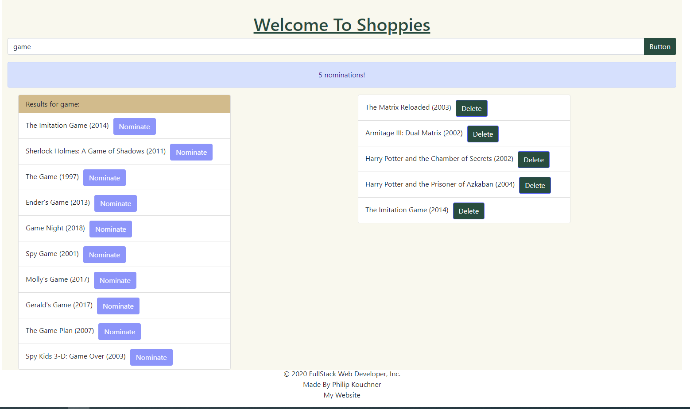

  [](https://shields.io/)
  [](https://shields.io/)
  
  

# Introduction: UX Developer Intern & Web Developer Intern Challenge - Summer 2021

## The Shoppies: Movie awards for entrepreneurs :

Shopify has branched out into movie award shows and we need your help. Please build us an app to help manage our movie nominations for the upcoming Shoppies.

## User Story

```
As a user you can search OMDB for movies, and allow the user to save their favorite films they feel should be up for nomination. When they've selected 5 nominees they should be notified they're finished.
```
## Screenshot 



## Getting Started

* Using OMDB api key - to receive relevant information
* Using React - npx create-react-app "name of the project"
* Node.js - Axios
* gh-pages - create live server

### Prerequisites

Visual Studio Code 

## Built With

- HTML 5 
- CSS
- JavaScript
- React
- React hooks

## Authors

- Philip Kouchner
- Github Live Link -  https://philipk-webdev.github.io/Shoppies/
- Github Repository - https://github.com/PhilipK-webdev/Shoppies
- Portfolio - http://philipkouchner.com/